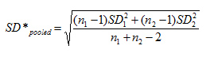

```{r setup, include=FALSE}
knitr::opts_chunk$set(echo = TRUE, warning=FALSE)

```
  
\newpage


# Introduction   
   
" Par Inc., is a major manufacturer of golf equipment. Management believes 
that Par’s market share could be increased with the introduction of a cutresistant, longer-lasting golf ball. Therefore, the research group at Par has 
been investigating a new golf ball coating designed to resist cuts and provide 
a more durable ball. The tests with the coating have been promising. One of 
the researchers voiced concern about the effect of the new coating on driving 
distances. Par would like the new cut-resistant ball to offer driving distances 
comparable to those of the current-model golf ball. To compare the driving 
distances for the two balls, 40 balls of both the new and current models were 
subjected to distance tests. The testing was performed with a mechanical 
hitting machine so that any difference between the mean distances for the 
two models could be attributed to a difference in the design.
The results of the tests, with distances measured to the nearest yard, are 
contained in the data set “Golf”. Prepare a Managerial Report

1. Formulate and present the rationale for a hypothesis test that par could 
use to compare the driving distances of the current and new golf balls   

2. Analyze the data to provide the hypothesis testing conclusion. What is the 
p-value for your test? What is your recommendation for Par Inc.?   

3. Provide descriptive statistical summaries of the data for each model   

4. What is the 95% confidence interval for the population mean of each 
model, and what is the 95% confidence interval for the difference 
between the means of the two population?   

5. Do you see a need for larger sample sizes and more testing with the golf 
balls? Discuss."   


\newpage

## Libraries/Packages
```{r}
library(readxl)
library(DataExplorer)
library(psych)
library(Hmisc)
library(ggplot2)
library(esquisse)
```

\newpage


## Set Working Directory
``` {r}
setwd("Z:/Projects for Github/Hypothesis Testing/GOLF BALL/Golf-Ball-Project")
getwd()
```

## Import Dataset
```{r}
mydata <- read_excel("Golf .xls")
attach(mydata)
```


## Import Dataset"
```{r}
mydata
```


\newpage
# Assumptions   
   
   
" The sample size of the data set is 40 from each model of golf ball. 
Central Limit Theorem states that irrespective of the shape of the original 
population, the sampling distribution of the mean will approach a normal 
distribution as the size of the sample increases and becomes large (>30). 
We also assume that the sample estimate will be reflective of the reality."


# Step by step approach   

We shall follow step by step approach to arrive to the conclusion as follows:   

1. Exploratory Data Analysis
2. Descriptive Statistics
3. Data Visualization
4. Hypothesis formation
5. Selection of appropriate Hypothesis Testing method
6. 95% Confidence Intervals
7. Need of Larger Sample Size
8. Conclusion and Recommendation

## Exploratory Data Analysis. Check Dimension of the dataset

```{r}
introduce(mydata)

```
```{r}
plot_intro(mydata)
```


We see that there are 40 Rows and 2 Columns


## Check for Missing Values

```{r}
plot_missing(mydata)
```
   
   There are no missing values   
   


## Dataset Summary
```{r}
describe(mydata)
```

+ Current: The minimum value is 255 yards and the maximum value is 
289 yards. The average value is 270.3 yards   

+ New: The minimum value is 250 yards and the maximum value is 289 
yards. The average value is 267.5 yards


# Descriptive Statistics


```{r}
describe(mydata)
```

```{r}
summary(mydata)
```

   
     
| Measures of  Dispersion | Current |  New  |
|:-----------------------:|:-------:|:-----:|
|          Range          |   34.0  |  39.0 |
|       1st Quartile      |  263.0  | 262.0 |
|       3rd Quartile      |  275.2  | 274.5 |
|  Inter Quartile Range   |   12.2  |  12.5 |
|         Variance        |   76.6  |  97.9 |
|    Standard Deviation   |   8.8   |  9.9  |


# Data Visualization – Histogram and Boxplot   
   
```{r}


ggplot(mydata) +
 aes(x = Current) +
 geom_histogram(bins = 10L, fill = "#440154") +
 labs(x = "Driving Distance") +
 theme_minimal()
```

```{r}
ggplot(mydata) +
 aes(x = "", y = Current) +
 geom_boxplot(fill = "#440154") +
 theme_minimal()
```


```{r}

ggplot(mydata) +
 aes(x = New) +
 geom_histogram(bins = 15L, fill = "#31688e") +
 labs(x = "Driving Distance") +
 theme_minimal()
```

```{r}
ggplot(mydata) +
 aes(x = "", y = New) +
 geom_boxplot(fill = "#31688e") +
 theme_minimal()

```


## Key Observations:
+ The average distance covered by ‘New’ golf ball (Mean = 267.5) is 
lower as compared to ‘Current’ golf ball (Mean = 270.3)
+ ‘New’ golf ball observed to have relatively higher variation in the data 
distribution in comparison to ‘Current’ golf ball 
+ No outliers were observed in the data range for Current & New data
sets.


# Hypothesis formation  

For the hypothesis formulation, we have to define the Null Hypothesis & 
Alternative Hypothesis. 
+ Null Hypothesis
o It is a hypothesis that says there is no statistical significance 
between the two variables. The null hypothesis is formulated such 
that the rejection of the null hypothesis proves the alternative 
hypothesis is true
+  Alternative Hypothesis

It is one that states there is a statistically significant relationship 
between two variables. The alternative hypothesis is the hypothesis 
used in hypothesis testing that is contrary to the null hypothesis
In Par Inc. case, the management would like to produce the new golf balls once 
it is comparable to the current golf balls. A sample of 40 balls of both the current 
and new models were tested with a mechanical hitting machine so that any 
difference between the mean distances for the two models could be attributed to 
a difference in the two models. Therefore, a hypothesis test that Par Inc. could 
use to compare the driving distance of the current and new golf balls. The Null 
Hypothesis & Alternative Hypothesis is formulated as follow:   

**Null Hypothesis (H0): µ1 - µ2 = 0 (i.e. they are the same)**  

**Alternative Hypothesis (Ha): µ1 - µ2 ≠ 0 (i.e. they are not the same)**  

Where,   

+  **µ1: Mean driving distance of current model golf ball**
+  **µ2: Mean driving distance of new golf ball**  

By formulation of above hypotheses, we assume that the current and new golf 
balls show no significant difference to each other.


# Hypothesis Testing Method   

Based on the details shared for the Par Inc. project, we can assume the 
following:   

+ One machine
+ Two populations
+ No other influences considered
+ Independently chosen   

It seems to be an independent sample case. The two-tailed test will be 
applicable for the project.   

Let us calculate the p-value using the R function ‘t.test’.   
   
```{r}
t.test(Current,New)
```

Since it is a two-tailed test, the p-value = 0.188 ÷ 2 = 0.094.    

The p-value for the two-tailed test is 0.094, which is greater than level of 
significance α (0.05). Therefore, the Null Hypothesis (H0) will not be rejected. 
The conclusion is that this data does not provide statistical evidence that the 
new golf balls have either a lower mean driving distance or a higher mean 
driving distance. This implies that Par Inc. should take the new golf balls in 
production as the p-value indicate that there is no significant difference between 
estimated population mean of current as well as new golf balls.   
   
         
## Confidence Interval   

**Analysis of Current Model**:    
```{r}
t.test(Current)
```

   
       
**Inference**:    
The 95% confidence interval of population mean for Current model 
is between 267.4757 & 273.0743. This implies that, with 95% confidence, we 
can say that the sample mean driving distance of current balls will be within this
range


**Analysis of New Model**:   
```{r}
t.test(New)
```


**Inference**:    
The 95% confidence interval of population mean for New model is 
between 264.3348 & 270.6652. This implies that, with 95% confidence, we can 
say that the sample mean driving distance of New balls will be within this range.
95% confidence interval for the difference between the means of the 
two population:


```{r}
t.test(Current,New)
```
   
**Inference**:    
The 95% confidence interval of difference in population mean 
between both the models is between **–1.38 yards on the lower end 6.93** 
**yards on the upper end**. This implies that, with 95% confidence, we can say 
that the difference in sample mean driving distance of both the models will be 
within the above range. For the 40 balls we have taken in this sample, the 
difference in mean driving distance is -2.775 yards (267.5 – 270.275) which falls 
in the range.


## Need of Larger Sample Size:   

Steps to follow:   

+  Get the difference between two sample means (2.775 as calculated 
earlier)
+  Calculate pooled Standard Deviation using following formula:   
   
$$\sqrt\frac{(n_1-1)*SD + (n_2-1)*SD}{n_1+n_2-2} $$



+  Execute the power T Test, with current parameters, and decide if larger 
size is needed.
+  Calculate the samples number (in case Power of Test is insignificant)


# Pooled Standard Deviation:   


+   Calculation to see need of Larger Sample Size:
+   Power of the test

```{r}
delta=mean(Current)-mean(New)

pooledSD <- (((40-1)*(8.75^2)+(40-1)*(9.9^2))/(40+40-2))^0.5

delta
pooledSD
```


# Power T Test:   
     
```{r}
power.t.test(n=40, delta = 2.775, sd=9.342,
 sig.level = 0.05,type = "two.sample",
 alternative = "two.sided" )
```

**Inference**:    
The Power of test is 0.258 or 25.8%, which means there are only 
25% chances that the null hypothesis will not be rejected when it is false. 
Hence, we should revisit the number of samples to increase the power of test.


**Recalculate Sample size using Power T Test**:    

Consider Power of test 95%, and significance level 0.188 (The P value 
calculated) and execute the Power T test once again.

```{r}
power.t.test(power=0.95, delta = 2.775, 
 sd=9.342,sig.level = 0.188,type = "two.sample",
 alternative = "two.sided" )
```
    
        
**Inference**:   
We can see that we need sample size of 200 (rounded up) to get 
95% power of Test.


# Conclusion and Recommendation   

+  From the Preliminary Data Analysis, we confirm that the mean driving 
distance of New Ball is less than Old Ball. (267.5 yards Vs 270.3 yards).   

+   When the Data Set explored further with the help of descriptive statistics 
and Visualization, we learnt that   

+ The New Golf ball has relatively higher variation.
+ No outliers observed in both the samples.
+ Both the samples have nearly Normal distribution; however New 
Design is slightly more skewed towards right.   

+ The Hypothesis Testing concludes that this data does not provide 
statistical evidence that the new golf balls have either a lower or higher
mean driving distance.   

+ This implies that Par Inc. should take the new golf balls in production as 
the p-value indicate that there is no significant difference between 
estimated population mean of current as well as new golf balls.   

+ Confidence Interval:   

 + The 95% confidence interval of population mean for Current model 
is between 267.4757 & 273.0743.   

 + The 95% confidence interval of population mean for New model is 
between 264.3348 & 270.6652.   

+ Power of Test:   

 + Although the 2 Tail Hypothesis Test recommends to launch the new
ball design into Production, the Power of Test is only 25%.   

 + In order to have 95% Power of Test, it is recommended to have
the number of samples as 200 for both the designs, and then
conclude the Hypothesis test recommendations.


